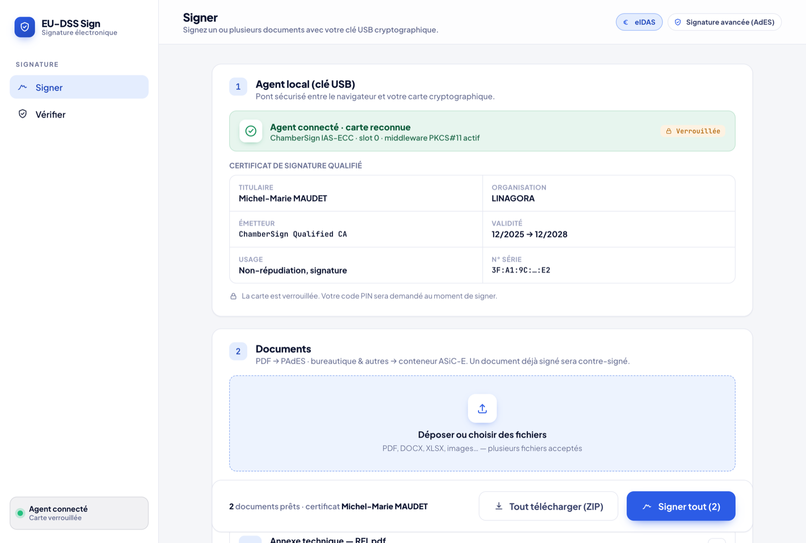
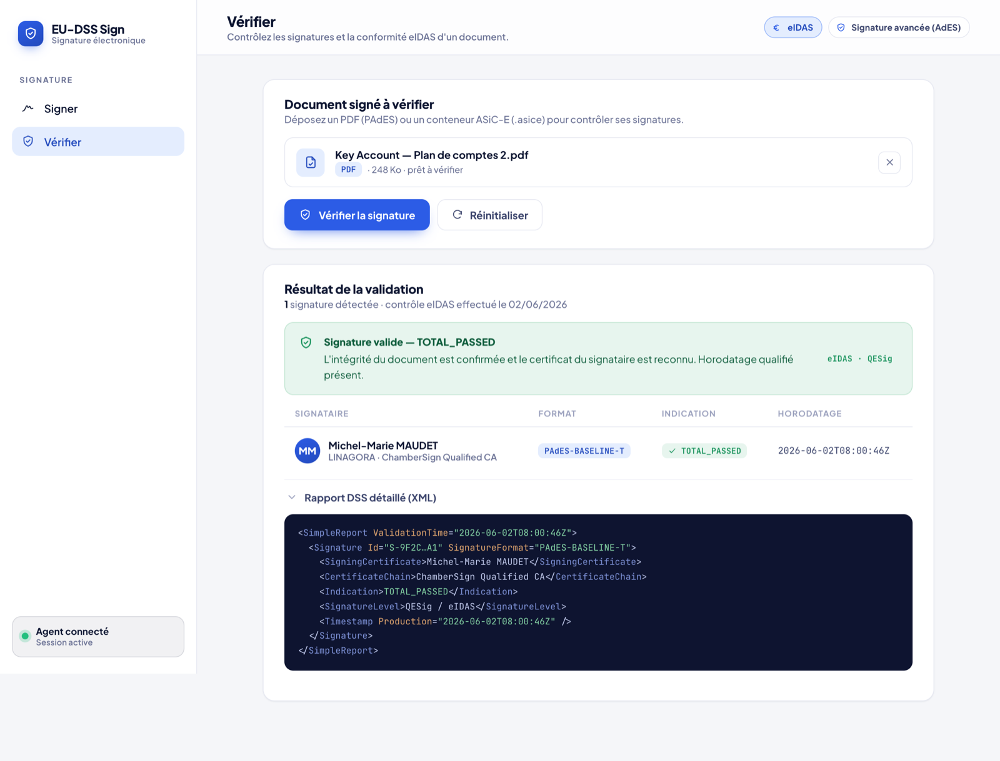

# eu-dss

[](LICENSE)


> Application web pour **signer et vérifier des documents** (PAdES / ASiC) à l'aide d'une **clé USB cryptographique** (carte à puce / token PKCS#11), construite sur la bibliothèque **EU DSS** (Digital Signature Services, v6.4).

Public visé : utilisateurs disposant d'un token de signature qualifiée (ex. **ChamberSign**, middleware **IDOPTE**) qui souhaitent signer des PDF ou d'autres documents en PAdES-B-T / ASiC depuis leur poste, ainsi que les développeurs qui font tourner ou étendent la plateforme.

- **Installation utilisateur (Windows, macOS & Linux)** : voir le guide pas-à-pas [`docs/INSTALL.md`](docs/INSTALL.md).
- **Téléchargements** : voir [Releases](#téléchargements--releases).

---

## Aperçu

**Signer** : agent local connecté, certificat de signature qualifié détaillé, puis flux de signature :



**Vérifier** : verdict eIDAS (TOTAL_PASSED) et rapport DSS détaillé :



> Interface identique sur Windows, macOS et Linux. Parcours complet (PIN, signature, récapitulatif) dans le [guide d'installation](docs/INSTALL.md#à-quoi-ça-ressemble--le-parcours-de-signature).

---

## Comment ça marche

Le **modèle de sécurité** repose sur trois principes :

1. **La clé privée reste sur le token.** L'agent ne reçoit jamais la clé ni ne l'exporte. Le serveur lui transmet une **empreinte (digest)** à signer, et l'agent renvoie la **valeur de signature calculée par la carte**.
2. **Agent local en HTTPS sur `https://localhost:9795`**, avec un certificat auto-signé `CN=localhost` (SAN `localhost` / `127.0.0.1`) généré **par poste**. Les installeurs **Windows MSI** et **macOS `.pkg`** rendent ce certificat de confiance automatiquement ; par la voie « jar » (développement) il est accepté une fois dans le navigateur.
3. **PIN au moment de signer.** L'agent démarre **verrouillé**. Le PIN est saisi dans l'application au moment de signer (`/rest/unlock`), n'est jamais mis en cache, et la session se reverrouille après un délai d'inactivité (5 min par défaut).

### Flux de signature (3 allers-retours)

```
  Navigateur (UI :5173)        Serveur (:8080, EU DSS)        Agent (:9795, token PKCS#11)
        │                              │                               │
        │ 1. /api/sign/prepare ───────▶│                               │
        │    (document + paramètres)   │  getDataToSign + digest       │
        │◀──── empreinte (digest) ─────│                               │
        │                              │                               │
        │ 2. /rest/sign (digest) ──────┼──────────────────────────────▶│  la CARTE signe l'empreinte
        │◀──── valeur de signature ────┼───────────────────────────────│  (clé privée jamais exposée)
        │                              │                               │
        │ 3. /api/sign/assemble ──────▶│  embarque la signature        │
        │    (document + signature)    │  (PAdES / ASiC)               │
        │◀──── document signé ─────────│                               │
        ▼                              ▼                               ▼
```

L'agent expose en plus `/rest/unlock` (saisie du PIN), `/rest/lock`, `/rest/status` et `/rest/certificates` (pour afficher le certificat de signature dans l'UI). Niveau de signature par défaut : **PAdES-B-T** (les conteneurs ASiC sont en **XAdES-B-T**) ; les niveaux **B / T / LT / LTA** et les empreintes **SHA-256 / 384 / 512** sont également pris en charge. L'horodatage (niveau T) utilise une TSA en ligne (par défaut `https://freetsa.org/tsr`).

---

## Architecture / modules

| Module | Rôle | Stack | Port |
|---|---|---|---|
| [`eu-dss-agent`](eu-dss-agent) | Agent local : pont PKCS#11 vers le token, signe une empreinte, gère la session PIN (verrou/déverrou) | Java 21, Javalin 6.7, DSS `dss-token`, BouncyCastle (TLS auto-signé), jar « shaded » | **9795** (HTTPS) |
| [`eu-dss-server`](eu-dss-server) | Backend de signature/vérification : workflow PAdES/ASiC (préparer l'empreinte → assembler la signature), validation, trust list (LOTL FR) | Java 21, Spring Boot 3.4, EU DSS 6.4 (`dss-pades-pdfbox`, `dss-asic-xades`, `dss-validation`, `dss-tsl-validation`…) | **8080** |
| [`eu-dss-ui`](eu-dss-ui) | Interface web : onglets **Signer** / **Vérifier**, assistant de prérequis (agent / carte / middleware), modale PIN | Vite 6, React 19, TypeScript 5.7 ; proxy `/api` → `:8080` | **5173** (dev) |

`eu-dss-server` et `eu-dss-agent` sont des modules Maven (parent `com.linagora.eudss:eu-dss-parent`, version `0.1.0-SNAPSHOT`). `eu-dss-ui` est un projet Node/npm indépendant.

---

## Prérequis

| Élément | Détail |
|---|---|
| **Token USB branché** | Carte à puce / clé cryptographique de signature, insérée. |
| **Middleware ChamberSign / IDOPTE** | Le pilote PKCS#11 de la carte (l'agent ne le fournit pas). Voir [`docs/INSTALL.md`](docs/INSTALL.md) pour le lien de téléchargement. |
| **Java 21** | Requis pour exécuter ou compiler l'agent et le serveur (sauf l'installeur MSI Windows, qui embarque son propre runtime Java). Sous macOS/Linux : Temurin JDK 21. |
| **Node.js + npm** | Uniquement pour le développement de l'UI (`eu-dss-ui`). |

Le guide d'installation détaillé pour les utilisateurs finaux est dans **[`docs/INSTALL.md`](docs/INSTALL.md)** (Windows MSI, macOS, Linux) ; il n'est pas dupliqué ici.

---

## Installation / démarrage rapide

### Windows (installeur MSI, recommandé)

L'installeur fait tout automatiquement (certificat de confiance + démarrage à l'ouverture de session, aucun PIN au démarrage, aucun certificat à accepter) :

1. Installer le middleware ChamberSign et brancher le token.
2. Télécharger et exécuter **[`EU-DSS-Agent-0.1.0.msi`](https://github.com/mmaudet/eu-dss-module/releases/download/eu-dss-agent-v0.1.0/EU-DSS-Agent-0.1.0.msi)**.
3. Ouvrir l'application de signature dans le navigateur.

Détails et captures d'écran : [`docs/INSTALL.md`](docs/INSTALL.md).

### macOS (installeur .pkg, recommandé)

Comme le MSI Windows, le `.pkg` fait tout automatiquement (certificat de confiance dans le trousseau Système + démarrage à l'ouverture de session, aucun certificat à accepter) :

1. Installer le middleware ChamberSign et brancher le token.
2. Télécharger **`EU-DSS-Agent-0.1.0.pkg`** ([Releases](https://github.com/mmaudet/eu-dss-module/releases/tag/eu-dss-agent-v0.1.0)) ; non signé → premier lancement par **clic droit → Ouvrir**.
3. Installer (mot de passe administrateur), puis ouvrir l'application de signature.

Détails + désinstallation : [`docs/INSTALL.md`](docs/INSTALL.md). (Firefox garde son propre magasin NSS, suivi séparé.)

### Linux (paquet .deb)

Le `.deb` (amd64) fait tout automatiquement, comme le MSI / le `.pkg` (certificat de confiance **système** + magasin **NSS** `~/.pki/nssdb` pour Chrome/Chromium installés en `.deb` + démarrage à l'ouverture de session graphique). Construit par l'intégration continue ([`linux-installer.yml`](.github/workflows/linux-installer.yml)) ; confiance système + autostart au login vérifiés sur un bureau Ubuntu 24.04. Publication en Release et validation de la signature réelle sur amd64 : en cours.

1. Installer le middleware ChamberSign (amd64) et brancher le token.
2. Récupérer **`eu-dss-agent_0.1.0_amd64.deb`** (artefact de CI, ou le construire avec `packaging/linux/build-agent-deb.sh`), puis l'installer : `sudo apt install ./eu-dss-agent_0.1.0_amd64.deb`.
3. Ouvrir l'application de signature dans le navigateur.

Détails + désinstallation (`apt remove`) : [`docs/INSTALL.md`](docs/INSTALL.md). **amd64 uniquement** pour la signature (middleware ChamberSign). La confiance navigateur couvre **Chrome/Chromium lisant `~/.pki/nssdb`** (p. ex. Google Chrome `.deb`) ; le **Chromium snap** (chromium par défaut d'Ubuntu, confiné) et **Firefox** gardent leur propre magasin (acceptation manuelle, suivi séparé).

### macOS / Linux (exécuter le jar, pour le développement)

Compiler l'agent et le serveur, puis lancer l'agent avec le script adapté à votre OS :

```bash
mvn -DskipTests package

# Agent local (token PKCS#11), choisir le script de votre OS :
./bin/eu-dss-agent-macos.sh       # macOS
./bin/eu-dss-agent-linux.sh       # Linux
# Windows (PowerShell, hors MSI) :  ./bin/eu-dss-agent-windows.ps1
```

L'agent démarre **verrouillé** et écoute sur `https://localhost:9795`. Le PIN est saisi dans l'application au moment de signer. Les scripts positionnent des valeurs par défaut (pilote PKCS#11, slot, port, hôtes CORS) que vous pouvez surcharger via les variables `EUDSS_*` (voir [Développement](#développement)).

Par cette voie « jar » sous macOS/Linux, vous acceptez le certificat `localhost` **une fois** dans le navigateur (l'auto-confiance est gérée par les installeurs MSI / `.pkg` / `.deb`).

### Stack de développement (serveur + UI)

Dans trois terminaux (agent ci-dessus, puis) :

```bash
# Backend Spring Boot (http://localhost:8080)
./bin/eu-dss-server.sh

# UI Vite + React (http://localhost:5173, proxy /api -> :8080)
./bin/eu-dss-ui-dev.sh        # fait `npm install` au besoin puis `npm run dev`
```

Puis ouvrir **http://localhost:5173**.

---

## Développement

### Compiler & tester (Java)

```bash
mvn -DskipTests package    # compile l'agent + le serveur (jars dans */target)
mvn test                   # exécute les tests JUnit 5 (agent + serveur, dont un test E2E avec agent stubbé)
```

### UI

```bash
cd eu-dss-ui
npm install
npm run dev        # serveur de dev Vite (:5173)
npm run build      # tsc -b && vite build (build de production)
```

### Variables d'environnement de l'agent (`EUDSS_*`)

Résolues dans [`eu-dss-agent/.../config/AgentConfig.java`](eu-dss-agent/src/main/java/com/linagora/eudss/agent/config/AgentConfig.java) (et [`AgentTls.java`](eu-dss-agent/src/main/java/com/linagora/eudss/agent/tls/AgentTls.java) pour le keystore) :

| Variable | Défaut | Rôle |
|---|---|---|
| `EUDSS_PKCS11_DRIVER` | *selon l'OS* ¹ | Chemin de la bibliothèque PKCS#11 du middleware |
| `EUDSS_PKCS11_SLOT` | `0` | Index du slot (`slotListIndex`) du certificat de signature |
| `EUDSS_AGENT_PORT` | `9795` | Port d'écoute HTTPS |
| `EUDSS_CORS_HOSTS` | *origines `localhost`* ² | Origines web autorisées (CORS, origine complète avec schéma) |
| `EUDSS_AGENT_TLS` | `true` | HTTPS activé (`false` = HTTP en clair, pour le dev) |
| `EUDSS_AGENT_TLS_PASSWORD` | `eudss-agent` | Mot de passe du keystore TLS auto-signé |
| `EUDSS_AGENT_KEYSTORE` | *selon l'OS* ³ | Chemin du keystore TLS |
| `EUDSS_PIN_SESSION_TTL` | `300` | Délai (s) d'inactivité avant reverrouillage de la session PIN |
| `EUDSS_AGENT_PIN` | *(absent)* | Si défini → mode **headless** (déverrouillage auto au démarrage) ; sinon mode **interactif** (verrouillé jusqu'à `/rest/unlock`) |

¹ macOS `/Library/SCMiddleware/libidop11.dylib` · Linux `/usr/lib/SCMiddleware/libidop11.so` · Windows `C:\Program Files\Smart Card Middleware\bin\idoPKCS.dll`
² `http://localhost:5173,http://localhost:8080,http://localhost:4173`
³ Windows `%ProgramData%\eudss-agent\agent-keystore.p12` · Linux `/var/lib/eudss-agent/agent-keystore.p12` (machine) · sinon macOS `~/.eudss-agent/agent-keystore.p12`

### Variables d'environnement du serveur

Configuré via [`application.yml`](eu-dss-server/src/main/resources/application.yml) :

- `EUDSS_LOTL_ENABLED` (`eudss.lotl.enabled`, défaut `true`) : télécharge la trust list de l'UE (liste FR) au démarrage. À `false`, la validation reste *INDETERMINATE* faute d'ancres de confiance (utile en dev hors-ligne).
- TSA d'horodatage : `eudss.tsa.url` (défaut `https://freetsa.org/tsr`).

### Disposition / API

```
eu-dss/
├── eu-dss-agent/   # Javalin :9795, /rest/{health,status,unlock,lock,certificates,sign}
├── eu-dss-server/  # Spring Boot :8080, /api/sign/{prepare,assemble}, /api/validate
├── eu-dss-ui/      # Vite + React :5173, onglets Signer / Vérifier
├── bin/            # scripts de lancement (agent par OS, server, ui-dev)
├── packaging/      # build de l'installeur MSI Windows (jpackage + WiX)
├── macos/          # artefacts macOS (jar + script de lancement)
└── docs/           # INSTALL.md (FR) + specs/plans (docs/superpowers)
```

---

## Sécurité

- **Signature de l'empreinte uniquement** : l'agent reçoit un digest, jamais le document complet ni la clé. La clé privée ne quitte pas le token.
- **Certificat TLS auto-signé par poste** (`CN=localhost`, SAN `localhost`/`127.0.0.1`), généré sur chaque machine. Provisionné de confiance par les installeurs (Windows MSI ; macOS `.pkg` ; Linux `.deb` : magasin système **PEM** + NSS Chrome/Chromium) ; par la voie jar, accepté une fois dans le navigateur.
- **PIN demandé au moment de signer** (`POST /rest/unlock`), jamais persisté ; il est effacé de la mémoire (`zeroize`) après ouverture de la session du token.
- **TTL de session** : la session PIN se reverrouille après inactivité (défaut 300 s, `EUDSS_PIN_SESSION_TTL`). Les endpoints sensibles renvoient `401 locked` quand l'agent est verrouillé.
- **Mapping d'erreurs PKCS#11** sans nouvelle tentative automatique : PIN incorrect (`401`), PIN bloqué (`423`), token indisponible (`503`).

---

## Téléchargements / Releases

| Release | Contenu |
|---|---|
| [`eu-dss-agent-v0.1.0`](https://github.com/mmaudet/eu-dss-module/releases/tag/eu-dss-agent-v0.1.0) | Installeurs de l'agent (runtime Java embarqué, certificat de confiance + démarrage automatique) : **Windows MSI** [`EU-DSS-Agent-0.1.0.msi`](https://github.com/mmaudet/eu-dss-module/releases/download/eu-dss-agent-v0.1.0/EU-DSS-Agent-0.1.0.msi) · **macOS pkg** [`EU-DSS-Agent-0.1.0.pkg`](https://github.com/mmaudet/eu-dss-module/releases/download/eu-dss-agent-v0.1.0/EU-DSS-Agent-0.1.0.pkg) (non signé) |
| [`eu-dss-docs-v0.1.0`](https://github.com/mmaudet/eu-dss-module/releases/tag/eu-dss-docs-v0.1.0) | Guide d'installation : [PDF](https://github.com/mmaudet/eu-dss-module/releases/download/eu-dss-docs-v0.1.0/Guide-installation-eu-dss.pdf) · [HTML](https://github.com/mmaudet/eu-dss-module/releases/download/eu-dss-docs-v0.1.0/Guide-installation-eu-dss.html) |

Les installeurs sont construits par GitHub Actions via `jpackage` : Windows ([`windows-installer.yml`](.github/workflows/windows-installer.yml), + WiX), macOS ([`macos-installer.yml`](.github/workflows/macos-installer.yml), + `pkgbuild`/`productbuild`) et Linux ([`linux-installer.yml`](.github/workflows/linux-installer.yml), + `dpkg-deb`, amd64), sur tag `v*` ou déclenchement manuel.

---

## Documentation

- **[`docs/INSTALL.md`](docs/INSTALL.md)** : guide d'installation et de premiers pas (Windows MSI, macOS, Linux), avec captures d'écran.
- **[`docs/superpowers/`](docs/superpowers)** : specs et plans d'implémentation des incréments (signature multi-format, accès navigateur multiplateforme, PIN au moment de signer, assistant de prérequis, provisionnement Windows + macOS + Linux).

---

## Statut

Disponible et vérifié :

- **Signature PAdES-B-T (PDF) et ASiC-E/XAdES** (autres formats) ; niveaux B / T / LT / LTA, empreintes SHA-256/384/512.
- **Vérification** de documents signés (avec trust list FR via LOTL).
- **PIN saisi au moment de signer** (l'agent démarre verrouillé, reverrouillage après inactivité).
- **Assistant de prérequis** dans l'UI (détecte l'agent / la carte / le middleware et propose les téléchargements adaptés à l'OS).
- **Installeurs auto-provisionnants** (certificat de confiance + démarrage automatique, sans étape « accepter le certificat ») : **Windows MSI** et **macOS `.pkg`** (tous deux vérifiés de bout en bout, signature + vérification avec une clé ChamberSign qualifiée). **Linux `.deb`** (amd64) : confiance système (PEM) + autostart XDG au login vérifiés sur un bureau Ubuntu 24.04 ; confiance navigateur OK pour Chrome/Chromium `.deb` (Chromium snap + Firefox non couverts) ; signature réelle sur amd64 à valider.

En cours / conception : **validation de la signature réelle sur Linux amd64** + publication du `.deb` en Release, confiance **Firefox/NSS**, **signature/notarisation** du `.pkg` macOS, **multi-utilisateur / hébergement**.

---

## Contribuer

Les contributions sont les bienvenues ; ouvrez une **issue** ou une **pull request**. Pour démarrer, voir les sections **Installation / démarrage rapide** et **Développement** (build `mvn -DskipTests package`, tests `mvn test`, UI `npm run build`). Merci de garder des commits ciblés et de vérifier que `mvn test` et `npm run build` passent avant d'ouvrir une PR.

---

## Licence

Développé par **LINAGORA**. Construit sur la bibliothèque open source [EU DSS](https://ec.europa.eu/digital-building-blocks/sites/display/DIGITAL/Digital+Signature+Service+-++DSS) de la Commission européenne.

Sous licence **[GNU AGPL-3.0](LICENSE)**, © 2026 LINAGORA. Vous pouvez utiliser, étudier, modifier et redistribuer ce logiciel selon les termes de l'AGPL-3.0 ; toute version modifiée mise à disposition via un réseau doit elle aussi être publiée sous AGPL-3.0.
