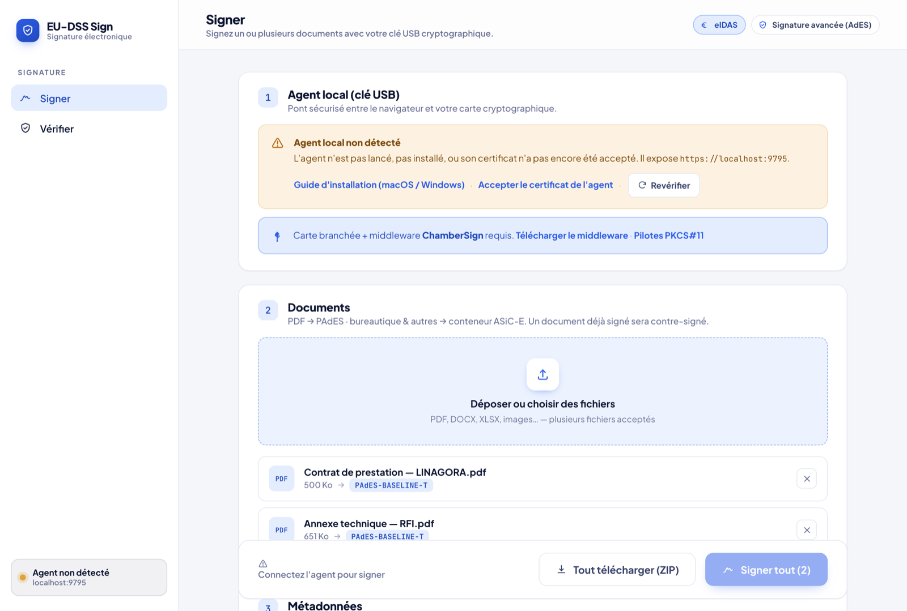
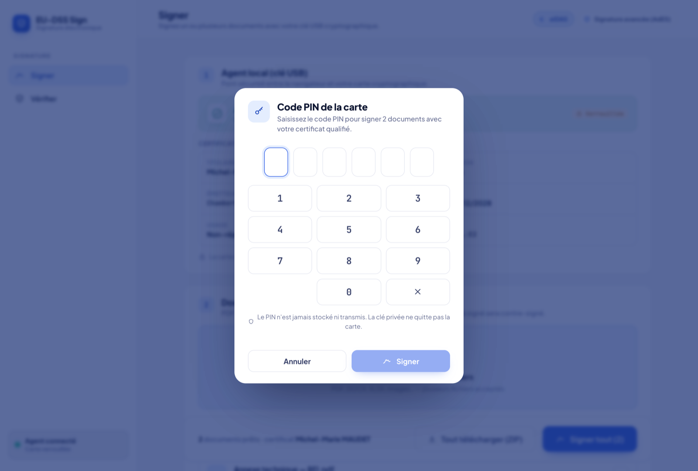
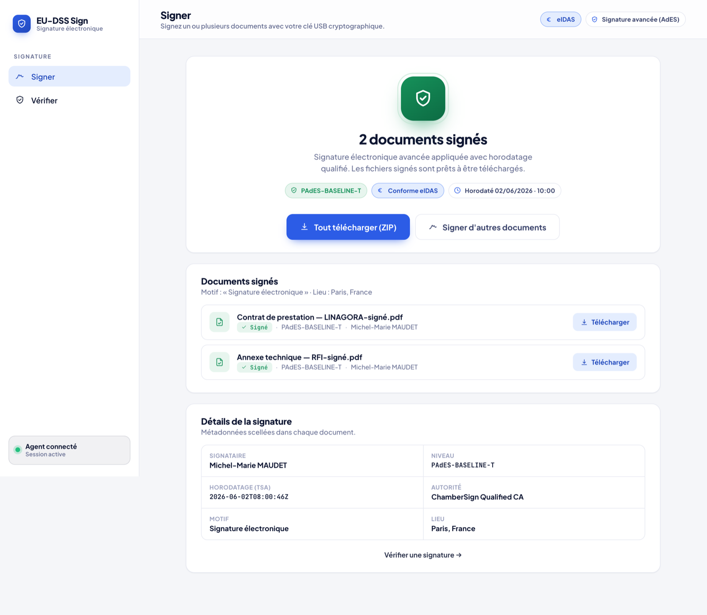

# EU-DSS Sign — Guide d'installation (Windows, macOS & Linux)

**EU-DSS Sign** est une application de bureau autonome pour **signer et vérifier des documents**
(PAdES / XAdES / ASiC) avec votre **clé USB cryptographique** (carte à puce / token PKCS#11).

L'installeur embarque **tout** : l'interface graphique, le moteur de signature EU DSS et le runtime
Java nécessaire. Il n'y a **rien d'autre à installer** côté logiciel (pas de Java à part, pas de
serveur à lancer).

> **Seul prérequis logiciel** : le middleware PKCS#11 fourni par le fabricant de votre token
> (ex. IDOPTE pour ChamberSign). Voir la section de votre OS ci-dessous.

---

## 1. Windows (recommandé — démarrer ici)

### 1.1 Récupérer l'installeur

L'installeur Windows est **signé via Azure Artifact Signing** (pas de blocage SmartScreen) et
l'UI est en français.

Téléchargez l'installeur depuis la [Release v1.1.0](https://github.com/mmaudet/eu-dss-module/releases/tag/v1.1.0) :

- **Recommandé (poste utilisateur)** : [`EU-DSS.Sign_1.1.0_x64-setup.exe`](https://github.com/mmaudet/eu-dss-module/releases/download/v1.1.0/EU-DSS.Sign_1.1.0_x64-setup.exe) — installeur NSIS, installation **par utilisateur, sans invite UAC**.
- **Alternative (administrateur / entreprise)** : [`EU-DSS.Sign_1.1.0_x64_fr-FR.msi`](https://github.com/mmaudet/eu-dss-module/releases/download/v1.1.0/EU-DSS.Sign_1.1.0_x64_fr-FR.msi) — installeur MSI signé, adapté aux déploiements administrateur.

Les deux installent la même application.

### 1.2 Installer le middleware PKCS#11

Avant (ou après) l'installation d'EU-DSS Sign, installez le pilote PKCS#11 de votre token :

- **ChamberSign / IDEMIA** → télécharger **IDOPTE** sur
  [support.chambersign.fr](https://support.chambersign.fr/pilotes/) et l'installer.
- **Autre fabricant** → suivre les instructions de votre fournisseur de token.

Branchez ensuite votre token USB.

### 1.3 Installer EU-DSS Sign

1. Double-cliquer le `.msi` (ou le `.exe`).
2. Suivre l'assistant d'installation en français.
3. À la fin, l'application est installée et un raccourci apparaît dans le menu Démarrer.

> L'installeur ne nécessite **pas** de Java ni de configuration réseau. Tout est embarqué.

### 1.4 Premier lancement et assistant de prérequis

1. Lancer **EU-DSS Sign** depuis le menu Démarrer.
2. Au premier démarrage, un assistant de prérequis s'affiche et vérifie :
   - la présence du middleware PKCS#11,
   - la détection du token.
3. Si tout est vert, l'assistant propose un **test du PIN** pour confirmer que la carte répond.
4. Cliquer **Terminer** : l'application est prête à signer.

---

## À quoi ça ressemble : le parcours de signature

> L'interface **EU-DSS Sign** est identique sur Windows, macOS et Linux.

**Si le token n'est pas encore branché ou le middleware manquant**, l'application affiche un
bandeau d'aide avec les liens de téléchargement :



**Une fois le middleware installé et le token branché** : l'état de la carte et le **certificat
de signature** s'affichent.


**Au moment de signer**, saisissez votre **code PIN** sur le pavé numérique (jamais stocké
ni transmis au réseau) :



**Documents signés** : récapitulatif, métadonnées, téléchargement individuel ou ZIP :



**Vérifier** une signature : verdict eIDAS (TOTAL_PASSED) et rapport DSS détaillé :


---

## 2. Linux (Ubuntu / Debian — paquet .deb)

> **amd64 uniquement** pour la signature : le middleware ChamberSign Linux n'existe qu'en
> amd64. Le paquet peut s'installer sur d'autres architectures, mais la signature réelle
> y est indisponible faute de middleware.

### 2.1 Récupérer le paquet

Téléchargez le paquet correspondant à votre distribution depuis la [Release v1.1.0](https://github.com/mmaudet/eu-dss-module/releases/tag/v1.1.0) :

- **Debian / Ubuntu** : [`EU-DSS.Sign_1.1.0_amd64.deb`](https://github.com/mmaudet/eu-dss-module/releases/download/v1.1.0/EU-DSS.Sign_1.1.0_amd64.deb)
- **Fedora / RHEL** : [`EU-DSS.Sign-1.1.0-1.x86_64.rpm`](https://github.com/mmaudet/eu-dss-module/releases/download/v1.1.0/EU-DSS.Sign-1.1.0-1.x86_64.rpm)

### 2.2 Installer le middleware PKCS#11

Installer le pilote PKCS#11 de votre token (ex. IDOPTE pour ChamberSign, paquet amd64).
Le module PKCS#11 est typiquement installé dans `/usr/lib/SCMiddleware/libidop11.so`.

Branchez votre token USB.

### 2.3 Installer EU-DSS Sign

```bash
sudo apt install ./<eu-dss-sign_version_amd64>.deb
```

La commande tire automatiquement les dépendances nécessaires (`pcscd`, `libccid`, etc.).

Pour Fedora / RHEL :

```bash
sudo rpm -i <eu-dss-sign_version_x86_64>.rpm
```

### 2.4 Lancer EU-DSS Sign

Lancer l'application depuis le menu des applications ou via le terminal. Suivre l'assistant
de prérequis au premier lancement (middleware → token → test PIN).

**Désinstaller** :

```bash
sudo apt remove eu-dss-sign     # Debian/Ubuntu
```

---

## 3. macOS (Apple Silicon / arm64)

> **arm64 uniquement** : les installeurs macOS sont construits pour Apple Silicon. Intel (x86_64)
> n'est pas supporté pour l'instant.

### 3.1 Récupérer le .dmg

Téléchargez le `.dmg` depuis la [Release v1.1.0](https://github.com/mmaudet/eu-dss-module/releases/tag/v1.1.0) : [`EU-DSS.Sign_1.1.0_aarch64.dmg`](https://github.com/mmaudet/eu-dss-module/releases/download/v1.1.0/EU-DSS.Sign_1.1.0_aarch64.dmg).

Il est **signé Developer ID et notarisé par Apple** : un simple double-clic suffit, aucun contournement Gatekeeper n'est nécessaire.

### 3.2 Installer le middleware PKCS#11

Installer le pilote PKCS#11 de votre token (ex. IDOPTE pour ChamberSign, module macOS).
Le module est typiquement installé dans `/Library/SCMiddleware/libidop11.dylib`.

Branchez votre token USB.

### 3.3 Ouvrir le .dmg et installer l'application

1. Double-cliquer le `.dmg`.
2. Glisser **EU-DSS Sign** dans le dossier **Applications**.
3. Fermer et éjecter le volume.

### 3.4 Premier lancement — Gatekeeper

L'application est **signée Developer ID** (Linagora) **et notarisée par Apple**. Gatekeeper
l'ouvre donc directement : un simple **double-clic** sur l'icône EU-DSS Sign dans Applications
suffit, aucun contournement n'est nécessaire.

### 3.5 Assistant de prérequis

Suivre l'assistant au premier lancement (middleware → token → test PIN → prêt à signer).

---

## 4. Signer un document

1. Ouvrir l'application, onglet **Signer**.
2. **Choisir le ou les documents** à signer (PDF → PAdES-B-T ; autres formats → XAdES-B-T / ASiC).
3. Cliquer **Signer** : l'application demande votre **code PIN de carte**.
4. La signature est calculée par la carte et appliquée au document ; un récapitulatif s'affiche.

> **Session PIN** : après une signature, la session reste active pendant **~5 minutes**
> (compte à rebours affiché), puis se reverrouille automatiquement. Vous pouvez cliquer
> **« Verrouiller »** à tout moment. Le PIN n'est jamais stocké sur le disque.

---

## 5. Dépannage

| Symptôme | Cause probable | Solution |
|---|---|---|
| **Middleware non détecté** | Pilote PKCS#11 du fabricant absent ou mal installé. | Installer le middleware (ex. IDOPTE pour ChamberSign), puis cliquer **« Revérifier »**. |
| **Token non détecté** | Token non branché, ou une autre application monopolise la carte. | Brancher le token, fermer les autres applis de carte à puce, cliquer **« Revérifier »**. |
| **Bouton « Signer » indisponible** | Backend embarqué en cours de démarrage (quelques secondes au premier lancement). | Attendre quelques secondes que l'indicateur de statut passe au vert. |
| **« PIN incorrect »** | Mauvais code PIN. | Ressaisir. ⚠️ **Après ~3 essais erronés, la carte se bloque** (déblocage auprès de l'émetteur). |

---

## 6. Sécurité

- **La clé privée ne quitte jamais le token.** L'application ne fait signer qu'un condensat
  (digest) par la carte via l'interface PKCS#11 ; la clé privée ne transite pas sur le réseau.
- **Le backend embarqué n'écoute que sur `127.0.0.1`** (port local choisi dynamiquement) ;
  aucun port n'est ouvert sur le réseau local ou Internet.
- **Le PIN n'est jamais écrit sur le disque** ni journalisé ; il est effacé de la mémoire après usage.
- Les signatures produites sont des **signatures électroniques avancées** (eIDAS, ex. PAdES-B-T
  avec horodatage de confiance). L'application ne certifie pas qu'elles sont qualifiées — cela
  dépend du certificat porté par le token.
